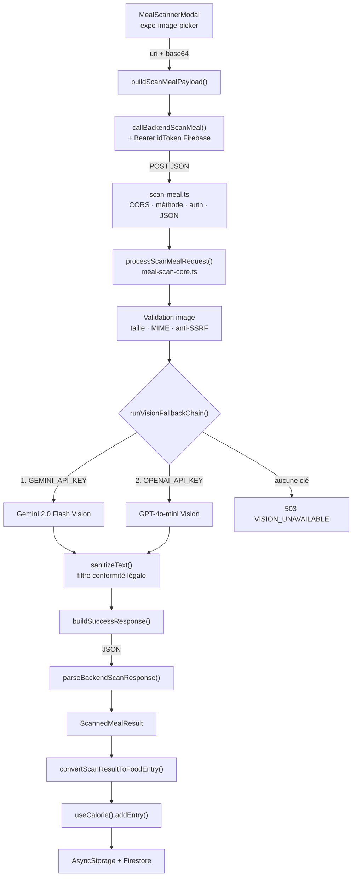

# BLUEPRINT INCONTOURNABLE — Meal Scanner IA

> **Document canonique d'architecture** du Scanner de Repas par IA de Pure Ascension.
> En cas de contradiction avec un autre document, **ce blueprint fait foi** pour l'architecture
> et les invariants. Les deux documents satellites restent la référence détaillée sur leur
> périmètre : [`meal-scanner-api.md`](./meal-scanner-api.md) (contrat HTTP champ par champ) et
> [`meal-scanner-deployment.md`](./meal-scanner-deployment.md) (procédure de déploiement).

Pure Ascension est un **outil de coaching fitness et nutrition**. Le scanner estime visuellement
les macronutriments d'un repas à partir d'une photo. Il **ne remplace pas un avis médical** et ne
doit produire **aucune allégation médicale**, ni côté prompt, ni côté réponse, ni côté interface.

---

## 0. Statut : la fonctionnalité existe déjà

Ce blueprint **ne décrit pas un chantier greenfield**. Le Meal Scanner est implémenté de bout en
bout et branché sur deux écrans (`HomeScreen`, `MealsScreen`). Toute intervention future est un
**delta** sur l'existant.

| Couche | Statut | Fichier de référence |
|---|---|---|
| Endpoint HTTP + auth | Implémenté | `netlify/functions/scan-meal.ts` |
| Pipeline Vision + parsing serveur | Implémenté | `netlify/functions/meal-scan-core.ts` |
| Alias de compatibilité | Implémenté | `netlify/functions/scan-meal-photo.ts` |
| Vérification token Firebase | Implémenté | `netlify/functions/verify-firebase-token.ts` |
| Client API + parsing + types | Implémenté | `src/services/mealScannerService.ts` |
| Fixtures de test | Implémenté | `src/services/mealScannerMocks.ts` |
| UI modale complète | Implémenté (~1 345 lignes) | `src/components/MealScannerModal.tsx` |
| Journalisation du repas | Implémenté | `src/context/CalorieContext.tsx` |
| Suite de tests | Implémenté (runner maison) | `src/__tests__/mealScanner.test.ts` |

**Conséquence pratique :** avant d'écrire une ligne de code, lire `mealScannerService.ts` en
entier. C'est le point de couplage entre les quatre contrats de données décrits en section 3.

---

## 1. Architecture générale



**Principe directeur n°1 — aucune clé Vision côté client.** Le mobile ne connaît que l'URL de
l'endpoint Netlify. `GEMINI_API_KEY` et `OPENAI_API_KEY` ne sont lues que dans
`meal-scan-core.ts`, côté serveur. Le préfixe `EXPO_PUBLIC_*` est **interdit** pour ces clés :
il inline la valeur dans le bundle JS distribué.

**Principe directeur n°2 — pas de `firebase-admin` sur le chemin du scan.** La vérification du
token est une validation RS256 maison (`verify-firebase-token.ts`) contre les certificats publics
Google, mis en cache pour la durée de vie du conteneur. Ce choix évite la dépendance à
`serviceAccountKey.json`, qui est gitignoré et donc **absent du build Netlify**. Voir la dette
identifiée en section 10.

---

## 2. Inventaire des fichiers — source de vérité

Toute modification du scanner touche un sous-ensemble de cette liste, et rien d'autre.

### Serveur

| Fichier | Responsabilité |
|---|---|
| `netlify/functions/scan-meal.ts` | Enveloppe HTTP : CORS, `OPTIONS`, rejet non-`POST`, extraction du Bearer, parsing du corps, filet `try/catch` final |
| `netlify/functions/meal-scan-core.ts` | Tout le reste : types, `SYSTEM_PROMPT`, validations, appels Vision, parsing, `sanitizeText`, constructeurs de réponse |
| `netlify/functions/scan-meal-photo.ts` | Ré-export du handler — **contrat strictement identique** |
| `netlify/functions/verify-firebase-token.ts` | Validation RS256 du token Firebase |
| `netlify.toml` | Déclare `timeout = 26` pour les deux fonctions de scan |

### Client

| Fichier | Responsabilité |
|---|---|
| `src/services/mealScannerService.ts` | Types partagés, `callBackendScanMeal`, parsing, `convertScanResultToFoodEntry`, erreurs typées |
| `src/services/mealScannerMocks.ts` | Fixtures Gemini/OpenAI — permet de tester sans consommer de quota |
| `src/components/MealScannerModal.tsx` | UI complète : sélection image, shimmer, résultats, édition, validation |
| `src/context/CalorieContext.tsx` | Journal quotidien — **seul point d'entrée** pour enregistrer un repas |
| `src/theme/theme.ts` | Charte graphique — aucune couleur en dur ailleurs |

---

## 3. Les quatre contrats de données

C'est **le cœur du blueprint**. Une donnée traverse quatre représentations distinctes entre le
modèle de vision et le journal. Casser l'une d'elles casse silencieusement le scanner.

### 3.1 Contrat A — sortie du modèle (JSON brut)

Imposé par `SYSTEM_PROMPT` (`meal-scan-core.ts:322`). Le modèle doit renvoyer du JSON strict, sans
markdown ni texte hors JSON.

```json
{
  "isFood": true,
  "name": "Nom descriptif du plat en français",
  "calories": 520, "proteins": 45, "carbs": 50, "fats": 12, "fibers": 8,
  "fitnessNote": "Conseil nutritionnel Pure Ascension court et concret",
  "confidence": 0.85,
  "items": [
    { "name": "Poulet grillé", "portion": "150g", "calories": 240, "proteins": 35, "carbs": 0, "fats": 5, "fibers": 0 }
  ]
}
```

Règles imposées au modèle, à ne pas affaiblir :

- **Décomposition obligatoire.** Interdiction de regrouper sous « légumes mélangés », « bowl »,
  « accompagnement ». Cible : 5 à 12 items sur une assiette complexe, minimum 3 dès que plusieurs
  composants sont visibles.
- **Cohérence arithmétique.** Les totaux du repas doivent être la somme des items à ±5 %.
- **Clarté de l'image.** Image floue ou sombre : `confidence` entre 0.40 et 0.65, et mention
  explicite dans `fitnessNote`.
- **Non-aliment.** Réponse figée avec `isFood: false`, tous les macros à 0, `confidence: 0.15`,
  `items: []`.
- **Conformité.** Aucun terme médical, clinique ou thérapeutique. Vocabulaire fitness/nutrition
  uniquement.

### 3.2 Contrat B — objet serveur `MealOutput`

```ts
export interface MealOutput {
  name: string;
  calories: number; proteins: number; carbs: number; fats: number; fibers: number;
  fitnessNote: string;
  confidence: number;
  isFood?: boolean;
  // Alias de rétrocompatibilité — conservés en sortie, jamais lus en entrée
  mealName?: string; totalCalories?: number; totalProteins?: number;
  totalCarbs?: number; totalFats?: number; totalFibers?: number;
  healthAdvice?: string; notes?: string;
  items?: IdentifiedFoodItem[];
}
```

Le parsing serveur renvoie un `VisionParseResult` discriminé, ce qui rend les trois issues
explicites et non confondables :

```ts
export type VisionParseResult =
  | { type: 'food';        meal: MealOutput }
  | { type: 'non_food';    meal: MealOutput }
  | { type: 'parse_error' };
```

### 3.3 Contrat C — enveloppe HTTP

Succès (`200`) :

```json
{ "success": true, "source": "gemini", "meal": { }, "mealName": "…", "totalCalories": 520 }
```

Erreur :

```json
{ "success": false, "error": "…", "message": "…", "code": "NOT_FOOD", "isFood": false }
```

`error` et `message` portent volontairement le même texte : `error` sert aux intégrations
historiques, `message` est ce qui s'affiche à l'utilisateur. Les deux doivent rester en français
et rester utilisables tels quels dans l'UI.

### 3.4 Contrat D — objet client `ScannedMealResult`

```ts
export interface ScannedMealResult {
  title: string;          // ← mappé depuis meal.name ou meal.mealName
  confidence: number;     // ← toujours normalisé sur 0–1
  fitnessNote: string;
  densityScore: string;
  kcal: number; proteins: number; carbs: number; fats: number; fibers: number;
  items: IdentifiedFoodItem[];
  benefits: string[];
  source?: ScanSource;    // 'gemini' | 'openai' | 'fallback' | 'custom'
}
```

Trois renommages à mémoriser, sources classiques de bugs silencieux :
`name` → `title`, `calories` → `kcal`, et `fibres` (orthographe française) accepté en entrée comme
alias de `fibers`.

### 3.5 Contrat de sortie — `FoodEntry`

```ts
export interface FoodEntry {
  id: string; name: string;
  kcal: number; proteins: number; carbs: number; fats: number;
  fibers?: number;
  time: string; // "HH:MM"
}
```

`convertScanResultToFoodEntry()` produit un `Omit<FoodEntry, 'id' | 'time'>` : `addEntry()`
génère l'`id` et l'heure. Deux invariants d'affichage :

- Le nom est **toujours** préfixé `[IA] ` — c'est ce qui distingue visuellement un repas scanné
  d'une saisie manuelle dans le journal.
- `fibers` n'est ajouté que s'il est strictement positif, pour ne pas polluer les entrées avec des
  zéros non significatifs.

---

## 4. Pipeline serveur — ordre imposé

L'ordre des étapes est un choix de sécurité : **aucune ressource coûteuse n'est engagée avant que
l'appelant soit authentifié**. Ne jamais réordonner.

1. `OPTIONS` → `200` immédiat avec les en-têtes CORS.
2. Méthode ≠ `POST` → `405 METHOD_NOT_ALLOWED`.
3. Auth (si `SCAN_REQUIRE_AUTH` ≠ `false`) → `401 AUTH_REQUIRED` ou `401 AUTH_INVALID`.
4. Parsing du corps → `400 INVALID_JSON`.
5. Présence d'une image → `400 MISSING_IMAGE`.
6. Validation image : taille, MIME, anti-SSRF.
7. Chaîne Vision : Gemini, puis OpenAI, puis `503`.
8. `sanitizeText()` sur tous les champs textuels.
9. Construction de la réponse.

### Garde-fous d'entrée

| Garde-fou | Valeur | Constante |
|---|---|---|
| Taille max décodée | 5 Mo | `MAX_BASE64_BYTES` |
| Timeout appel Vision | 25 000 ms | `VISION_FETCH_TIMEOUT_MS` |
| Timeout fonction Netlify | 26 s | `netlify.toml` |
| MIME acceptés | `image/jpeg`, `image/jpg`, `image/png`, `image/webp` | `ALLOWED_MIME_TYPES` |

Le timeout Vision (25 s) est délibérément **inférieur** au timeout Netlify (26 s). Cette marge
d'une seconde garantit qu'un appel Vision lent produit une erreur JSON propre plutôt qu'un
timeout brut de la plateforme, illisible pour le client. Modifier l'une de ces deux valeurs sans
l'autre casse cette garantie.

### Anti-SSRF sur `imageUrl`

`validateImageUrl()` rejette : les protocoles autres que `http:`/`https:`, `localhost`,
`127.0.0.1`, `::1`, les domaines `.local`, et les plages privées `10.*`, `172.16-31.*`,
`192.168.*`, `169.254.*` (métadonnées cloud). Toute évolution de ce champ doit conserver ces
rejets.

---

## 5. Codes d'erreur — table canonique

| Code | HTTP | Cause | Action côté client |
|---|---|---|---|
| `METHOD_NOT_ALLOWED` | 405 | Verbe ≠ POST | Bug d'intégration |
| `AUTH_REQUIRED` | 401 | Aucun Bearer | `ScanAuthError` → inviter à se connecter |
| `AUTH_INVALID` | 401 | Token expiré/invalide | `ScanAuthError` → inviter à se reconnecter |
| `INVALID_JSON` | 400 | Corps illisible | Bug d'intégration |
| `MISSING_IMAGE` | 400 | Aucun champ image | Bug d'intégration |
| `IMAGE_TOO_LARGE` | 400 | > 5 Mo | Recompresser avant renvoi |
| `INVALID_IMAGE_FORMAT` | 400 | MIME refusé | Message utilisateur |
| `INVALID_IMAGE_URL` | 400 | URL rejetée (SSRF) | Message utilisateur |
| `IMAGE_READ_ERROR` | 400 | Téléchargement distant échoué | Proposer un nouvel essai |
| `NOT_FOOD` | 422 | Aucun aliment détecté | `NonFoodScanError` → écran dédié, **pas** une erreur technique |
| `VISION_UNAVAILABLE` | 503 | Aucune clé Vision configurée | Message de repli |
| `SCAN_UNAVAILABLE` | 503 | Exception non gérée | Message de repli + bouton réessayer |

**Invariant de traitement des erreurs :** `NOT_FOOD` n'est pas un échec. C'est un résultat valide
qui mérite son propre écran (« Aucun aliment détecté sur cette photo… ») avec une invitation à
reprendre la photo. Le confondre avec une panne technique dégrade fortement l'expérience.

Côté client, deux erreurs typées portent cette distinction et **doivent être interceptées avant**
le `catch` générique :

```ts
export class NonFoodScanError extends Error { /* → écran « pas d'aliment » */ }
export class ScanAuthError    extends Error { /* → écran « connecte-toi »  */ }
```

---

## 6. Contrat frontend

### Machine à états de la modale

`idle` → `picking` → `scanning` (shimmer) → `result` | `non_food` | `auth_error` | `error`

Depuis `result`, l'utilisateur peut ajuster la portion et les macros avant validation. Depuis
`error`, `lastScanRef` permet de relancer le scan sans re-sélectionner l'image — comportement à
préserver, il évite une reprise de photo frustrante après une coupure réseau.

### Persistance locale

| Clé AsyncStorage | Rôle |
|---|---|
| `@pure_ascension_pending_scan_v1` | Scan en cours non validé — survit à une fermeture d'app |
| `@pure_ascension_scanned_history_v1` | Historique des scans validés |

### Charte graphique

Toutes les valeurs viennent de `src/theme/theme.ts`. **Aucune couleur, taille ou espacement en
dur** dans le composant.

| Rôle | Token |
|---|---|
| Accent principal, badges | `colors.sage.*` (`500: #5E8455`) |
| Fonds, surfaces | `colors.sand.*` (`50: #FBF8F3`) |
| Texte | `colors.ink.*` (`900: #1E2A22`) |
| Accent chaud, CTA secondaire | `colors.clay.*` |
| États | `colors.status.{success,warning,danger,info}` |
| Titres | `fontFamily.spectral` |
| Interface, chiffres | `fontFamily.hanken` |

Motif de modale de l'app : `Modal` React Native natif, `animationType="slide"`, `transparent`,
overlay + `SafeAreaView`. Ni `expo-router`, ni bibliothèque de bottom-sheet. Retour haptique via
`expo-haptics` sur les interactions principales.

---

## 7. Variables d'environnement

| Variable | Portée | Requis | Rôle |
|---|---|---|---|
| `GEMINI_API_KEY` | Serveur Netlify | Oui | Vision principale (Gemini 2.0 Flash) |
| `OPENAI_API_KEY` | Serveur Netlify | Recommandé | Repli (GPT-4o-mini) |
| `FIREBASE_PROJECT_ID` | Serveur Netlify | Non (défaut `pure-ascension`) | `aud`/`iss` attendus dans le token |
| `SCAN_REQUIRE_AUTH` | Serveur Netlify | Non | `false` désactive l'auth — **dev local uniquement** |
| `EXPO_PUBLIC_MEAL_SCAN_ENDPOINT` | Client | Non | Surcharge l'URL de l'endpoint |

Sans surcharge, l'endpoint est résolu dynamiquement : chemin relatif `/.netlify/functions/scan-meal`
sur web, URL absolue `https://pure-ascension.netlify.app/...` sur natif — le natif n'ayant pas
d'origine relative.

**Interdits absolus :**

- Aucune clé en clair dans le code, y compris en valeur de repli d'un `process.env.X || '…'`.
- `GEMINI_API_KEY` et `OPENAI_API_KEY` ne portent **jamais** le préfixe `EXPO_PUBLIC_`.
- `SCAN_REQUIRE_AUTH=false` ne doit jamais être positionné sur l'environnement de production.

---

## 8. Tests

Il n'y a **ni Jest ni Vitest** dans ce projet. La suite est un runner maison exécuté via `tsx` :

```bash
npm run test:meal-scanner   # npx tsx src/__tests__/mealScanner.test.ts
npm run compliance          # node scripts/compliance-check.js
```

`mealScannerMocks.ts` fournit des réponses Gemini et OpenAI figées : l'interface se teste
intégralement sans consommer de quota d'API. Tout scénario ajouté doit passer par ces fixtures
plutôt que par un appel réel.

Scénarios limites à couvrir pour toute modification du scanner :

| Scénario | Attendu |
|---|---|
| Image nette et valide | `200` + `items.length ≥ 3` sur assiette complexe |
| Image floue ou sombre | `confidence` entre 0.40 et 0.65, mention dans `fitnessNote` |
| Image non alimentaire | `422 NOT_FOOD` → écran dédié, pas d'erreur technique |
| Image > 5 Mo | `400 IMAGE_TOO_LARGE` |
| MIME non supporté (GIF, PDF) | `400 INVALID_IMAGE_FORMAT` |
| `imageUrl` pointant sur une IP privée | `400 INVALID_IMAGE_URL` |
| Réponse Vision entourée de ```` ```json ```` | Parsée correctement (les fences sont retirées) |
| Réponse Vision non parsable | Pas de crash — repli ou erreur propre |
| Sans Bearer | `401 AUTH_REQUIRED` |
| Token expiré | `401 AUTH_INVALID` |
| Aucune clé Vision configurée | `503 VISION_UNAVAILABLE` |
| Coupure réseau pendant le scan | Erreur affichée + relance possible via `lastScanRef` |

---

## 9. Conformité légale — Iron Protocol

La conformité est appliquée à **trois niveaux successifs**, et les trois sont nécessaires :

1. **Prompt** — `SYSTEM_PROMPT` interdit explicitement le vocabulaire médical au modèle.
2. **Serveur** — `sanitizeText()` filtre les sorties du modèle, y compris quand celui-ci ignore
   la consigne. C'est le garde-fou réel : le niveau 1 est une demande, le niveau 2 est une
   garantie.
3. **Build** — `npm run compliance` vérifie les textes statiques de l'application contre le
   lexique de `STYLE_GUIDE.md`.

Toute nouvelle chaîne de caractères visible par l'utilisateur (message d'erreur, libellé, conseil)
doit passer `npm run compliance` avant commit.

---

## 10. Dette et angles morts identifiés

Constats issus de l'audit du code existant. Aucun n'est bloquant pour le scanner aujourd'hui, mais
tous méritent une décision explicite.

### Bloquant hors périmètre scanner

`netlify/functions/stripe-webhook.ts:11` et `netlify/functions/apply-referral.ts:4` importent
statiquement `./serviceAccountKey.json`. Ce fichier est correctement gitignoré
(`.gitignore:49`) et **absent du dépôt** — vérifié : `git ls-files` ne le connaît pas. Ces deux
fonctions échoueront donc au build Netlify. Le scanner n'est pas affecté puisqu'il utilise le
vérificateur RS256 maison, ce qui valide a posteriori ce choix d'architecture. La correction
consiste à faire migrer ces deux fonctions vers le même motif.

### Qualité des données du scanner

- **`densityScore` est codé en dur à `'A+'`** (`mealScannerService.ts:246`). Le champ est affiché
  comme s'il était calculé alors qu'il est constant. Soit on le calcule réellement à partir de la
  densité nutritionnelle, soit on le retire de l'interface — l'état actuel est trompeur.
- **Valeurs de repli silencieuses** (`mealScannerService.ts:247-250`) : en cas de parsing échoué,
  `roundMacro` substitue 520 kcal / 38 P / 45 G / 16 L. Un utilisateur peut donc enregistrer un
  repas entièrement fictif sans le moindre avertissement. À minima, marquer le résultat comme
  dégradé dans l'interface.
- **`confidence` par défaut à 0.92** (`parseConfidence`) quand le champ est absent : une valeur de
  confiance élevée attribuée à une réponse dont on n'a justement pas la confiance.

### Outillage

- **Pas de `.env.example`** à la racine, alors que cinq variables sont nécessaires. C'est le
  premier obstacle pour tout nouvel environnement.
- **Pas de runner de test standard** : la suite maison n'a ni rapport structuré, ni intégration CI
  possible en l'état.
- **Valeur de repli en clair pour la clé Firebase web** dans `src/services/firebase.ts:8`. Cette
  clé est publique par conception côté Firebase, mais le motif `process.env.X || '<valeur>'`
  contredit la règle « aucune clé en clair » et ne doit pas être imité pour les clés Vision.

---

## 11. Invariants — la checklist avant tout commit

1. Aucune clé d'API en clair, aucun `EXPO_PUBLIC_` sur une clé Vision.
2. L'ordre du pipeline serveur est préservé : auth avant tout travail coûteux.
3. `NOT_FOOD` est traité comme un résultat, jamais comme une panne.
4. `NonFoodScanError` et `ScanAuthError` sont interceptées avant le `catch` générique.
5. Les totaux du repas restent la somme des items à ±5 %.
6. Le préfixe `[IA] ` reste appliqué à toute entrée issue du scanner.
7. `addEntry()` est le seul point d'entrée vers le journal — pas d'écriture directe en storage.
8. Aucune couleur ni typographie en dur : tout vient de `theme.ts`.
9. Aucune allégation médicale ; `npm run compliance` passe.
10. `scan-meal` et `scan-meal-photo` exposent exactement le même contrat.
11. `npm run test:meal-scanner` passe, avec les fixtures et sans appel réel aux API.
